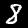
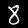

# noml

|       | average loss | average accuracy |
|-------|--------------|------------------|
| train | 0.14370      | 0.95605          |
| test  | 0.07252      | 0.97659          |

## embedding similarity 




cosine similarity: 0.68591

```bash
python3 embed.py
```

## info

train on 
- images [http://yann.lecun.com/exdb/mnist/train-images-idx3-ubyte.gz](http://yann.lecun.com/exdb/mnist/train-images-idx3-ubyte.gz)
- labels [http://yann.lecun.com/exdb/mnist/train-labels-idx1-ubyte.gz](http://yann.lecun.com/exdb/mnist/train-labels-idx1-ubyte.gz)

test on
- images [http://yann.lecun.com/exdb/mnist/t10k-images-idx3-ubyte.gz](http://yann.lecun.com/exdb/mnist/t10k-images-idx3-ubyte.gz)
- labels [http://yann.lecun.com/exdb/mnist/t10k-labels-idx1-ubyte.gz](http://yann.lecun.com/exdb/mnist/t10k-labels-idx1-ubyte.gz)


